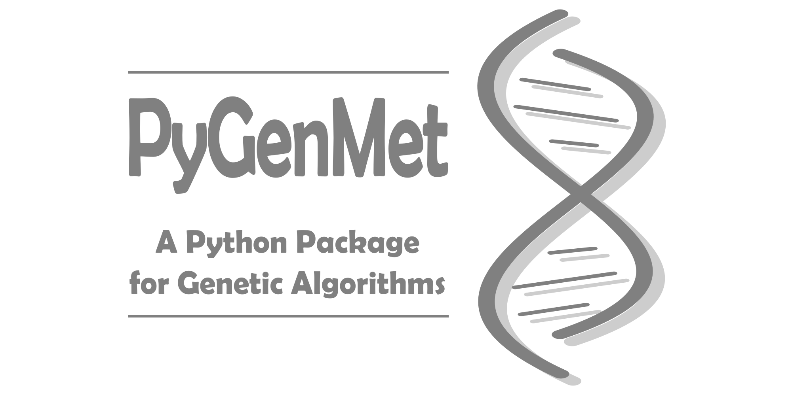
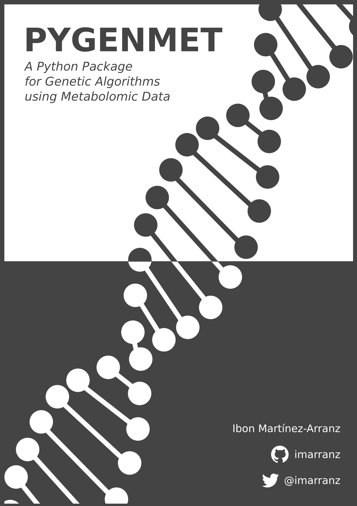
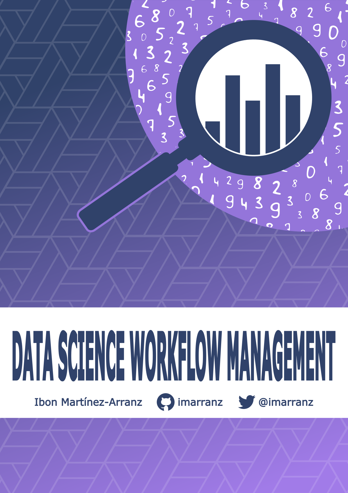

<table style="background-color:#EEEEEE; border:0px solid black; border-collapse: collapse; padding: 5px 20px 5px 20px;">
  <tr>
    <th style="padding: 5px 20px 5px 20px;"><a href="index">Home</a></th>
    <th style="padding: 5px 20px 5px 20px;"><a href="publications">Publications</a></th>
    <th style="padding: 5px 20px 5px 20px;"><a href="projects">Projects</a></th>
    <th style="padding: 5px 20px 5px 20px;"><a href="software">Software</a></th>
    <th style="width:100%"></th>
  </tr>
</table>

## Personal Projects

I am a data scientist with a passion for exploring data to gain deeper insights. I have worked on several projects involving data analysis and visualization. My goal is to create meaningful and interactive visualizations that allow users to gain insights into complex datasets. 

I believe data science is an incredibly powerful tool that can be used to answer questions, identify trends, and even predict future outcomes. With the right data and analysis, data science can be used to uncover insights that can inform decisions and lead to positive change. My projects range from simple data analysis to machine learning models and data visualization. I am passionate about using data to identify patterns and trends, discover hidden relationships, and make predictions. 

I am excited to share my work with you and I hope it will help you gain a better understanding of data science and its potential. Thank you for your time and attention.

### PYGENMET

I have developed this package of Genetic Algorithms to subtype patients with NASH, although it is a tool that can be used for all types of diseases. 

[On GitHub](https://github.com/imarranz/pygenmet)

<!--

  
  <aside>I have developed this package of genetic algorithms to subtype patients with NASH, although it is a tool that can be used for all types of diseases.</aside>
  

-->

### OPENAI API

Generate texts and images using OpenAI's GPT-3 based davinci and dall-e models.

[On GitHub](https://github.com/imarranz/streamlit-openai-app)

### PYGENMET MANUAL

I have written a manual to use the PYGENMET package, with descriptions about functions, examples, and code.

[On GitHub](https://github.com/imarranz/pygenmet-manual)

### Data Science Workflow Management

A very personal project. I like to be organized but especially in Data Science projects. Often, these types of projects can take a long time and for that reason it is very important to control all the analyzes and results. Developing a project efficiently forces us to have the data, the notebooks and the results well organized. In this project I try to generate a general workflow of a Data Science project.

[On GitHub](https://github.com/imarranz/data-science-workflow-management)

### mcm

The `mcm` function is a functional tool for analyzed different metrics from a confusion matrix. Can be very useful to analyze the performance of a binary classification model.

[On GitHub](https://github.com/imarranz/mcm)

### Miscellaneous Python Functions

This is a :gift: _mystery box_ :gift: where I am putting different functions that are useful to me on a day-to-day. What can you find here? Who knows! but it can help you or inspire you. 

[back](./)
